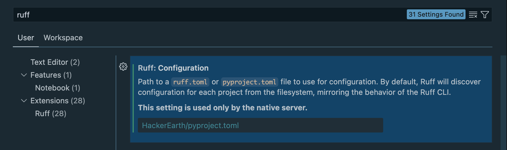

# he-qa-recommened-extensions README

You can author your README using Visual Studio Code. Here are some useful editor keyboard shortcuts:

* you need to configure Ruff extentsion after installing it.
* go to Settings with `Cmd+ ,` on macOS or `Ctrl+,` on Windows and Linux).
* search for `ruff` and point it to the path of ruff rules (eg. `HackerEarth/pyproject.toml`).

## For more information

